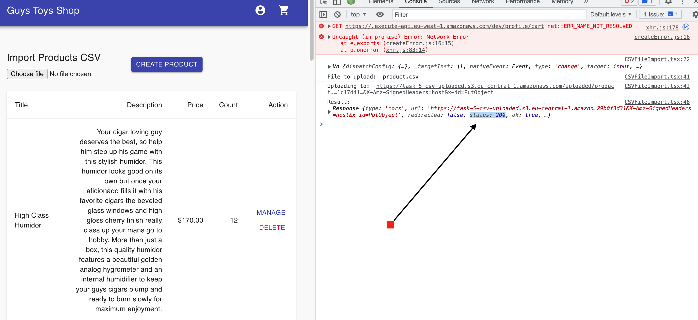
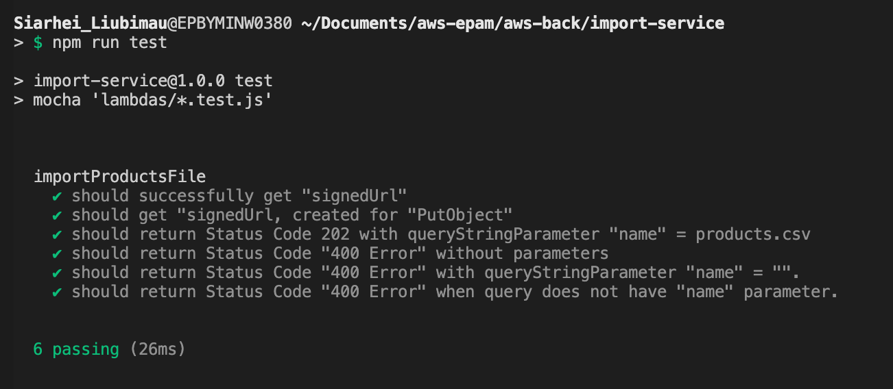

# __Task 5__

Task [description here](https://github.com/EPAM-JS-Competency-center/cloud-development-course-initial/blob/main/5_integration_with_s3/task.md)

Task due date / deadline date - 2022-07-25 07:00 / 2022-08-01 01:59(GMT+3)

Self check:
 
 TOTAL POINTS - _** 8 points**_
 
-----------
## __Evaluation criteria__

- [x] Cr.1: +1 - File serverless.yml contains configuration for importProductsFile function
- [x] Cr.2: +3 - The importProductsFile lambda function returns a correct response which can be used to upload a file into the S3 bucket
- [x] Cr.3: +4 - Frontend application is integrated with importProductsFile lambda
- [x] Cr.4: +5 - The importFileParser lambda function is implemented and serverless.yml contains configuration for the lambda

## __Additional (optional) tasks__

- [x] Ad.1: +1 (for JS only) - async/await is used in lambda functions
- [x] Ad.2: +1 (All languages) - importProductsFile lambda is covered by unit tests ((for JS only) aws-sdk-mock can be used to mock S3 methods
- [x] Ad.3: +1 (All languages) - At the end of the stream the lambda function should move the file from the uploaded folder into the parsed folder (move the file means that file should be copied into parsed folder, and then deleted from uploaded folder)
------------

# __Summary Report__
Evaluation criteria   | Description | URL 
-------|--------------|-----
Cr.1 | Link to serverless.yml with importProductsFile function   | https://github.com/slubimav/aws-back/blob/task-5/import-service/serverless.yml
Cr.2 | SignedURL to upload CSV in S3 by importProductsFile lambda | https://qid4b6lzgj.execute-api.eu-central-1.amazonaws.com/dev/import/?name=products.csv
Cr.3 | Try youself by sending CSV and check errors in Chrome console | https://d2ufhlxk3moxcg.cloudfront.net//admin/products
Cr.4 | Link to importFileParser. Link to serverless.yml see in Cr.1 | https://github.com/slubimav/aws-back/blob/task-5/import-service/lambdas/importFileParser.js
Ad.1 | async/await is used in importProductsFile | https://github.com/slubimav/aws-back/blob/task-5/import-service/lambdas/importProductsFile.js
Ad.1 | async/await is used in importFileParser | https://github.com/slubimav/aws-back/blob/task-5/import-service/lambdas/importFileParser.js
Ad.2 | Please check code by link and screenshots below | https://github.com/slubimav/aws-back/blob/task-5/import-service/lambdas/importProductsFile.js
Ad.3 | Please check code (Line 35-36) and screenshots below | https://github.com/slubimav/aws-back/blob/task-5/import-service/lambdas/importFileParser.js

## __FrontEnd__

```
The data in the FE is displayed from the API, which in turn takes it from the RDS AWS database.
Pictures are stored in a specially created S3 Bucket. CloudFront is configured for it.
Next to the price of each product, the remaining stock (stock) is displayed.

Implemented in the admin:
- displays a list of products
- uploading a CSV file with a list of products to the backet (to a specially created S3 Bucket).

```

* FrontEnd integrated with product service HTTP API & images from S3 Bucket: https://d2ufhlxk3moxcg.cloudfront.net

## __BackEnd__

```
Task-5 implements:

- automatic creation of the task-5-csv-uploaded bucket during deployment
  to upload CSV with automatic CORS assignment to it
  (in addition to task 5)

- uploading a CSV file with a list of products to the backet
  (specially created S3 Bucket - task-5-csv-uploaded)

- upon loading the csv file exactly in the uploaded/ directory, it works
  parsing a file with data output to CloudWatch logs

- after outputting data to CloudWatch, the CSV file is copied from uploaded/ to parsed/
  and the uploaded/ folder is deleted

All these tasks are implemented as part of the creation of a new import-service within the framework of
creating a microservice architecture application.

```

## Screenshots 

------------

### Frontend



### Tests



## __Swagger documentation__

https://app.swaggerhub.com/apis/slubimav/AWS-NodeJS/1.0.0/
