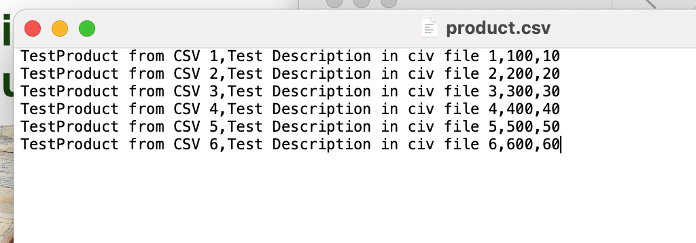
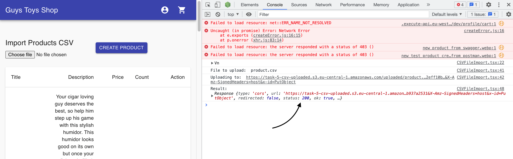
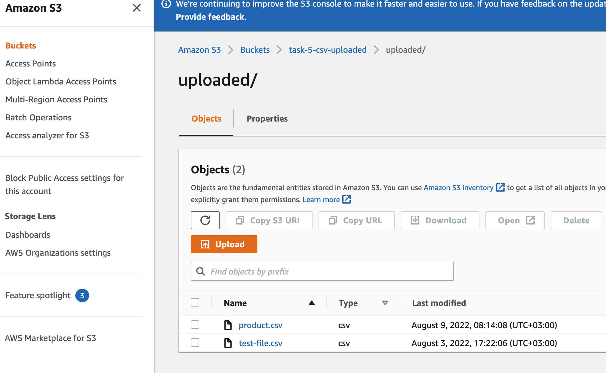
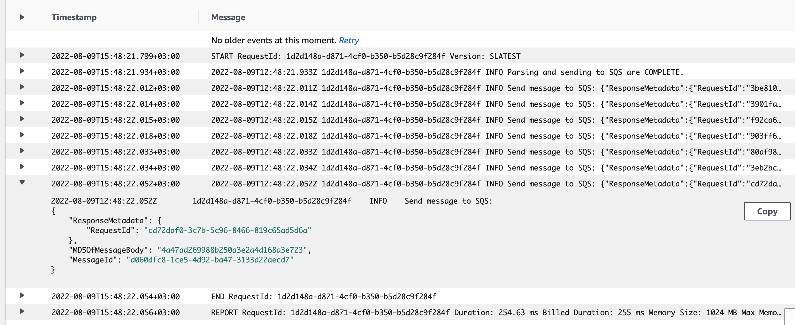
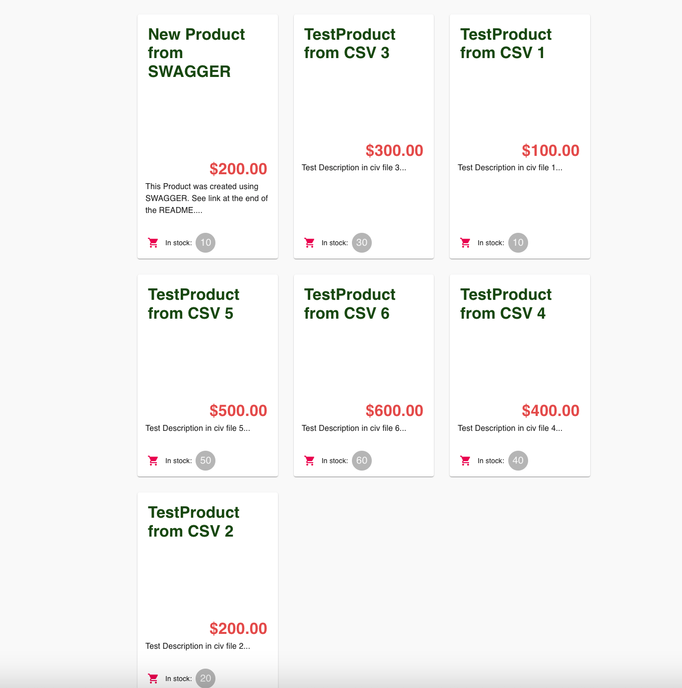
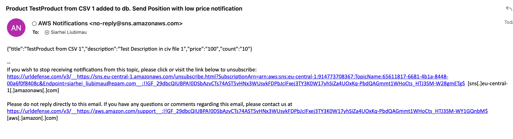

# __Task 6__

Task [description here](https://github.com/EPAM-JS-Competency-center/cloud-development-course-initial/blob/main/6_async_microservices_communication/task.md)

Task due date / deadline date - 	2022-08-01 07:00 / 2022-08-08 01:59(GMT+3)

Self check:
 
 TOTAL POINTS - _** 6 points**_
 
-----------
## __Evaluation criteria__

- [x] Cr.1: **1** - File **serverless.yml** contains configuration for **catalogBatchProcess** function
- [x] Cr.2: **2** - File **serverless.yml** contains policies to allow lambda **catalogBatchProcess** function to interact with SNS and SQS
- [x] Cr.3: **3** - File **serverless.yml** contains configuration for SQS **catalogItemsQueue**
- [x] Cr.4: **4** - File **serverless.yml** contains configuration for SNS Topic **createProductTopic** and email subscription

## __Additional (optional) tasks__

- [x] Ad.1: +1 **(All languages)** - **catalogBatchProcess** lambda is covered by **unit** tests
- [x] Ad.2: +1 **(All languages)** - set a Filter Policy for SNS **createProductTopic** in **serverless.yml** (Create an additional email subscription and distribute messages to different emails depending on the filter for any product attribute)
------------

# __Summary Report__

* Link to **/product-service/serverless.yml** - https://github.com/slubimav/aws-back/blob/task-6/product-service/serverless.yml
* Link to **/import-service/serverless.yml*** - https://github.com/slubimav/aws-back/blob/task-6/import-service/serverless.yml

Evaluation criteria   | Description | URL 
-------|--------------|-----
Cr.1 | File **serverless.yml** contains configuration for **catalogBatchProcess** function   | Lines 74-82 
Cr.2 | File **serverless.yml** contains policies to allow lambda **catalogBatchProcess** function to interact with SNS and SQS | Line 31 - 44
Cr.3 | File **serverless.yml** contains configuration for SQS **catalogItemsQueue** | Lines 26 - 27, 85 - 89
Cr.4 | File **serverless.yml** contains configuration for SNS Topic **createProductTopic** and email subscription | Lines 28 - 29, 90 - 93
Ad.1 | **catalogBatchProcess** lambda is covered by **unit** tests | https://github.com/slubimav/aws-back/blob/task-6/product-service/lambdas/catalogBatchProcess.test.js
Ad.2 | set a Filter Policy for SNS **createProductTopic** in **serverless.yml** | Lines 102 - 104 and 113 - 115

## __FrontEnd__

```
The data in the FE is displayed from the API, which in turn takes it from the RDS AWS database.
Pictures are stored in a specially created S3 Bucket. CloudFront is configured for it.
Next to the price of each product, the remaining stock (stock) is displayed.

Implemented in the admin:
- displays a list of products
- uploading a CSV file with a list of products to the backet (to a specially created S3 Bucket).

```

* FrontEnd integrated with product service HTTP API & images from S3 Bucket: https://d2ufhlxk3moxcg.cloudfront.net

## __BackEnd__

```
Task-6 implements:


* during deployment, S3 Bucket **task-5-csv-uploaded** is automatically created and Сors and Policy are automatically assigned to it.
* during deployment, an SQS queue **catalogItemsQueue** is automatically created, which is a trigger for a lambda **catalogBatchProcess**
* lambda **importFileParser**, upload csv file to S3 Bucket **task-5-csv-uploaded** and send messages in SQS queue **catalogItemsQueue**
* * during deployment, a lambda **catalogBatchProcess** is automatically created, which receives messages from the SQS queue **catalogItemsQueue** up to 5 pieces at a time and stores them in the database
* during deployment, an SNS queue **catalogItemsQueue** is automatically created, which sends messages to e-mail when parsing goods from csv, while messages are sorted by price. The price is 500$
* after loading the csv file, records are created in the database
* **catalogBatchProcess** is in the **product-service** service

```
# Steps to deploy:

0. confug product-service in .env
1. cd product-service
2. serverless deploy 
3. In AWS Console open SQS Service and copy SQS_ARN and SQS_URL for import-service
4. Insert SQS_ARN and SQS_URL in .env import-service
5. cd import-service
6. serverless deploy

## Screenshots 

------------
####  CSV file with producs for the insertion in DB



#### CSV file uploaded by FE in S3 bucket without Errors (StatusCode 200)



#### CSV file with data in S3 Bucket, in folder 'parsed'. Parsing has been done successfully and next screenshot presents a result.



#### Parsing has been done successfully and products has been sent to SQS queue.



#### Just created products at Home Page



#### Email with product's price less than 500

