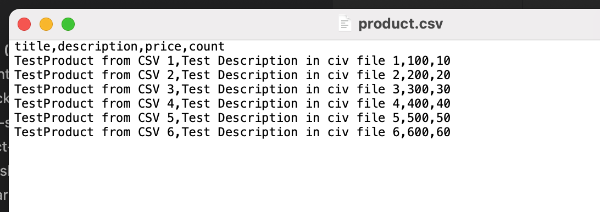
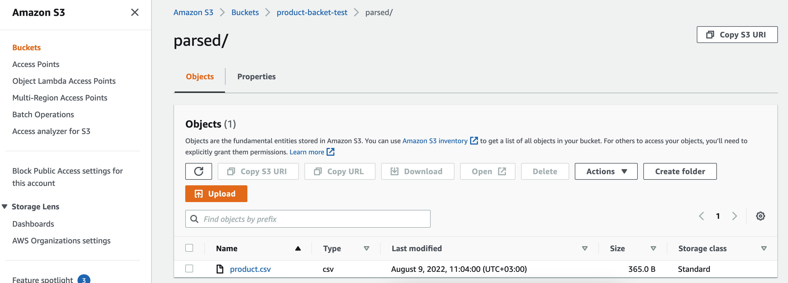

# __Task 7__

Task [description here](https://github.com/EPAM-JS-Competency-center/cloud-development-course-initial/tree/main/7_authorization)

Task due date / deadline date - 	2022-08-08 07:00 / 2022-08-15 01:59(GMT+3)

Self check:
 
 TOTAL POINTS - _** 6 points**_

-----------
## __Evaluation criteria__

- [x] Cr.1: **1** - **authorization-service** is added to the repo, has correct **basicAuthorizer** lambda and correct **serverless.yaml** file
- [x] Cr.2: **3** - **import-service** serverless.yaml file has authorizer configuration for the **importProductsFile** lambda. Request to the **importProductsFile** lambda should work only with correct **authorization_token** being decoded and checked by **basicAuthorizer** lambda. Response should be in 403 HTTP status if access is denied for this user (invalid **authorization_token**) and in 401 HTTP status if Authorization header is not provided.
- [x] Cr.3: **5** - update client application to send Authorization: Basic **authorization_token** header on import. Client should get **authorization_token** value from browser localStorage


## __Additional (optional) tasks__

- [x] Ad.1: **+1** - Client application should display alerts for the responses in 401 and 403 HTTP statuses. This behavior should be added to the **nodejs-aws-fe-main/src/index.tsx** file

------------

# __Summary Report__

* FrontEnd: https://d3ph6tvz43noms.cloudfront.net/ 


Evaluation criteria   | Description | URL 
-------|--------------|-----
Cr.1 | **authorization-service** has correct **serverless.yaml** file | https://github.com/SeLub/shop-aws-be/blob/task-7/authorization-service/serverless.yml
Cr.1 | **authorization-service** has correct **basicAuthorizer** lambda | https://github.com/SeLub/shop-aws-be/blob/task-7/authorization-service/functions/basicAuthorizer/basicAuthorizer.js
Cr.2 | **import-service** serverless.yml file has authorizer configuration for the **importProductsFile** lambda. | https://github.com/SeLub/shop-aws-be/blob/task-7/import-service/serverless.yml
Cr.2 | For Full Report - Look at the Screenshots Section. | Link You can test by Postman. Valid Key: Authorization, Value: Basic c2VsdWI6VEVTVF9QQVNTV09SRA==  https://od70lpymy5.execute-api.eu-central-1.amazonaws.com/dev/import/?name=products.csv
Cr.3 | update client application to send Authorization: Basic **authorization_token** header on import. Client should get **authorization_token** value from browser localStorage | https://github.com/SeLub/shop-aws-fe/pull/5/files
Ad.1 | Client application should display alerts for the responses in 401 and 403 HTTP statuses | https://github.com/SeLub/shop-aws-fe/blob/task-7/src/index.tsx

## Screenshots 

## __FrontEnd__

```
The data in the FE is displayed from the API, which in turn takes it from the RDS AWS database.
Pictures are stored in a specially created S3 Bucket. CloudFront is configured for it.
Next to the price of each product, the remaining stock (stock) is displayed.

Implemented in the admin:
- displays a list of products
- uploading a CSV file with a list of products to the backet (to a specially created S3 Bucket).

```

* FrontEnd integrated with product service HTTP API & images from S3 Bucket: https://d2ufhlxk3moxcg.cloudfront.net

## __BackEnd__

```
Task-7 implements:


* during deployment, S3 Bucket **task-5-csv-uploaded** is automatically created and Сors and Policy are automatically assigned to it.
* during deployment, an SQS queue **catalogItemsQueue** is automatically created, which is a trigger for a lambda **catalogBatchProcess**
* lambda **importFileParser**, upload csv file to S3 Bucket **task-5-csv-uploaded** and send messages in SQS queue **catalogItemsQueue**
* * during deployment, a lambda **catalogBatchProcess** is automatically created, which receives messages from the SQS queue **catalogItemsQueue** up to 5 pieces at a time and stores them in the database
* during deployment, an SNS queue **catalogItemsQueue** is automatically created, which sends messages to e-mail when parsing goods from csv, while messages are sorted by price. The price is 500$
* after loading the csv file, records are created in the database
* **catalogBatchProcess** is in the **product-service** service

```
# Steps to deploy:

0. confug product-service in .env
1. cd product-service
2. serverless deploy 
3. In AWS Console open SQS Service and copy SQS_ARN and SQS_URL for import-service
4. Insert SQS_ARN and SQS_URL in .env import-service
5. cd import-service
6. serverless deploy

## Screenshots 

------------
####  CSV file with producs for the insertion in DB



#### CSV file uploaded by FE in S3 bucket without Errors (StatusCode 200)


#### CSV file with data in S3 Bucket, in folder 'parsed'. Parsing has been done successfully and next screenshot presents a result.



#### Parsing has been done successfully and products has been sent to SQS queue.


#### Just created products at Home Page


#### Email with product's price less than 500

